# Facility Management System

The Facility Management System is a comprehensive management solution developed using the MERN (MongoDB, Express.js, React, Node.js) stack. It allows users to book time slots in facilities and provides role-based access control for various functionalities. This tool is a modified version of the one which was created as a project for DRDO Cabs during an internship. With four distinct roles, users can manage bookings, approvals, cancellations, and generate reports based on their permissions and responsibilities.

## Table of Contents

- [Screenshots](#screenshots)
- [Demo](#demo)
- [Features](#features)
- [Technologies Used](#technologies-used)
- [Packages Used](#packages-used)
- [Environment Variables](#environment-variables)
- [Getting Started](#getting-started)
- [Folder Structure](#folder-structure)
- [Running the Application](#running-the-application)
- [Author](#author)
- [Documentation](#documentation)

## Screenshots

Login Page
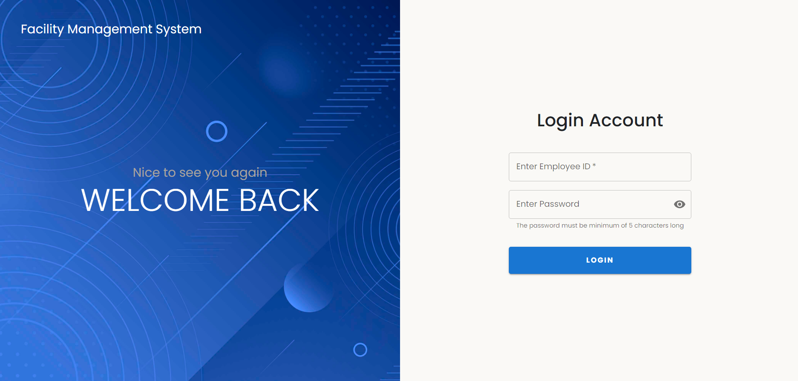

Reset Password Page
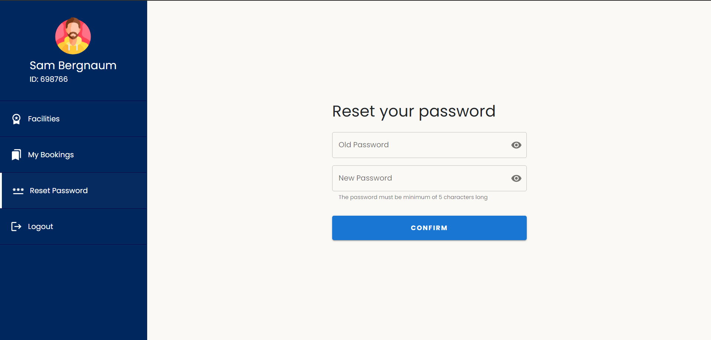

User Dashboard
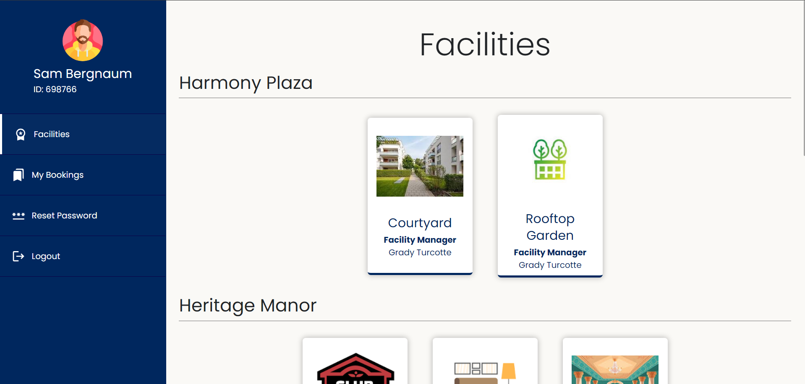

GD & FM Dashboard
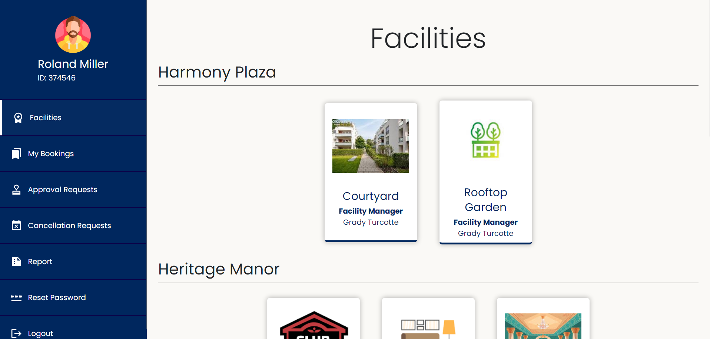

Calendar View
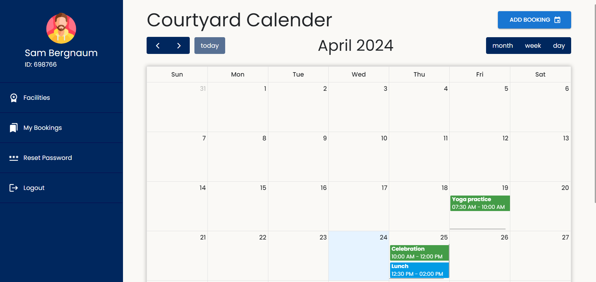

Create New Booking
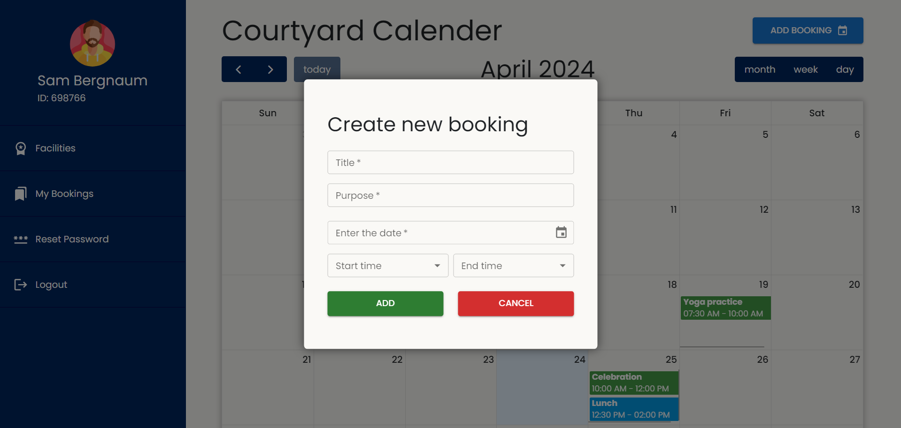

My Bookings Page
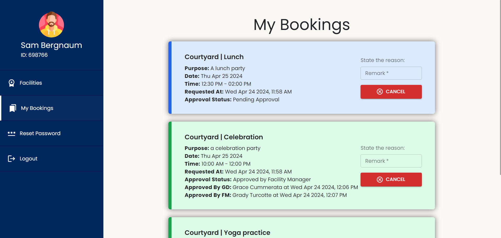

Approval Request Page of GD & FM
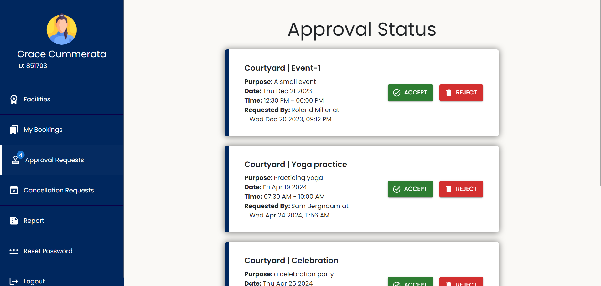

Cancellation Request Page of GD & FM
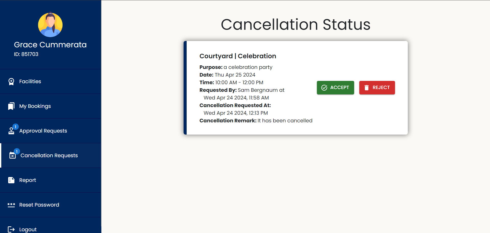

GD & FM Report Page
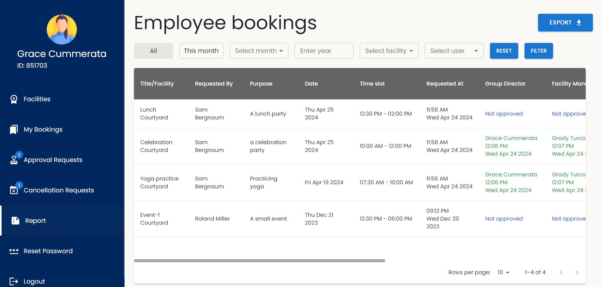

Admin Manage Facilities Page
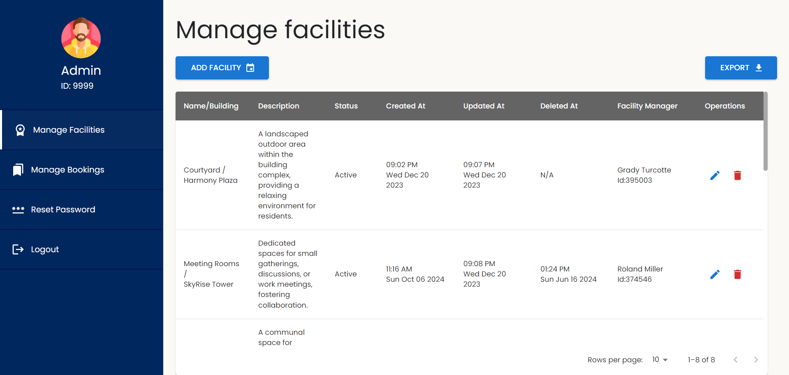

Admin Manage Bookings Page
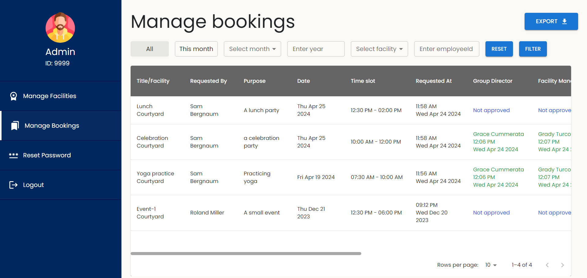

## Demo

You can see a live demo of the Facility Management System at [Demo Link](https://facility-bookings-manager.vercel.app/).

## Features

Here's the updated features section with the mention of admin powers:

## Features

- **Role-based Access**:

  - Users can be assigned one of four roles: User, Group Director (GD), Facility Manager (FM), or Admin, each with specific permissions and responsibilities.

- **Booking Management**:

  - Users can request bookings for time slots in facilities.
  - Bookings are then approved or rejected by designated approvers based on their role.

- **Booking Status Tracking**:

  - Users can track the status of their bookings, including pending, approved, and rejected statuses.
  - Timestamps of status changes are recorded for transparency and tracking.

- **Cancellation Requests**:

  - Users can initiate cancellation requests for their bookings.
  - Cancellation requests must be approved by designated approvers.

- **Approval Workflow**:

  - When a user initiates a booking, the status is set to pending.
  - The booking is forwarded to the appropriate approver (GD or FM) based on the user's group and facility.
  - The approver can then approve or reject the booking, providing a remark for the reason if rejected.
  - If approved, the booking status is updated accordingly.

- **Cancellation Workflow**:

  - Users can request cancellations for their bookings, specifying the reason for cancellation.
  - Cancellation requests must be approved by designated approvers (GD and FM) if the booking has been approved.
  - The approvers can accept or reject the cancellation request, providing remarks for the reason if rejected.
  - If approved, the booking status is updated to canceled, and the time slot becomes available for booking again.

- **Admin Powers**:
  Admins have additional powers, including:

  - Creating, editing, and deleting facilities.
  - Reassigning FM (Facility Manager) roles for facilities.
  - Approving or canceling bookings directly.
  - Generating reports in PDF format for facilities and bookings.

- **Report Generation**:

  - GDs, FMs, and Admins can generate reports in PDF format based on various criteria such as month, year, facility, or user group.

- **UI Navigation**:

  - Navigation options are tailored based on the user's role.
  - Users have easy access to relevant features and functionalities based on their permissions.

- **Single Sign-Out**(only in dev branch):

  - Integration with a Java Spring Boot project enables seamless single sign-out functionality across both the Java and Node.js servers.

- **Authentication**:
  - Users can authenticate using their employee ID and password for secure access to the system.

## Technologies Used

### Frontend

- **React**: JavaScript library for building user interfaces.
- **FullCalendar**: JavaScript event calendar for displaying bookings.
- **Material-UI**: React UI components for modern web applications.
- **React Router DOM**: Declarative routing for React applications.
- **Tailwind CSS**: Utility-first CSS framework for styling.
- **React Query**: Data fetching and caching library for React applications.

### Backend

- **Node.js**: JavaScript runtime environment for server-side development.
- **Express.js**: Web application framework for Node.js.
- **PostgresSQL**: SQL database for data storage.
- **Prisma**: ORM for database management.

## Packages Used

### Client-side

- **[@emotion/react](https://emotion.sh/docs/introduction)**: Library for CSS-in-JS styling.
- **[@mui/icons-material](https://mui.com/components/material-icons/)**, **[@mui/material](https://mui.com/getting-started/installation/)**: Material-UI components for UI design.
- **[@fullcalendar/react](https://fullcalendar.io/docs/react)**: React wrapper for FullCalendar.
- **[tailwindcss](https://tailwindcss.com/)**: Utility-first CSS framework for styling.
- **[axios](https://axios-http.com/)**: Promise-based HTTP client for the browser and Node.js.
- **[dayjs](https://day.js.org/)**: Library for date and time formatting.
- **[react-to-pdf](https://www.npmjs.com/package/react-to-pdf)**: Library for generating PDF documents from React components.
- **[react-query](https://react-query.tanstack.com/)**: Data fetching and caching library for React applications.

### Server-side

- **[@prisma/client](https://www.prisma.io/docs/concepts/components/prisma-client)**: Prisma client for database access.
- **[argon2](https://www.npmjs.com/package/argon2)**: Library for password hashing.
- **[express](https://expressjs.com/)**: Web application framework for Node.js.
- **[express-session](https://www.npmjs.com/package/express-session)**: Session middleware for Express.
- **[winston](https://github.com/winstonjs/winston)**: Logging library for Node.js.

## Environment Variables

The project relies on environment variables stored in a .env. file located at the root of the client directory and server directory to manage configurations. Ensure that essential variables such as database connection strings, API keys, or any other sensitive information are properly set up.

### Client-side Environment Variables

Create a `.env` file in the `client` directory and add the following variable:

```bash
VITE_APP_SERVER_URL="http://localhost:3000"
```

### Server-side Environment Variables

Create a `.env` file in the `server` directory and add the following variables:

```bash
DATABASE_URL="*YOUR POSTGRES DATABASE URL*"
SESSION_SECRET="*ANY SECRET*"
CLIENT_URL="http://localhost:5173"
```

Be sure to replace `*YOUR POSTGRES DATABASE URL*` with your actual postgress database url containing data and `*ANY SECRET*` with secret generated from secret generator to enable proper integration.

**Note**: Environment variables containing sensitive information like API keys, database credentials, or any other secrets should not be committed to version control. Ensure that the `.env` files are included in your project's `.gitignore` file to prevent accidental exposure of sensitive data.

## Getting Started

1. Clone this repository

to your local machine:

```bash
git clone https://github.com/Shivam-Sharma-1/Facility-Bookings-Manager.git
```

2. Change to the project directory:

```bash
cd facility-bookings-manager
```

3. Install client dependencies and start the client:

```bash
cd client
npm install
npm run dev
```

4. In another terminal tab install server dependencies and start the server:

```bash
cd server
npm install
npx prisma generate
npm run watch
npm run devT ##in separate terminal
```

## Folder Structure

The project structure is organized as follows:

```
facility-bookings-manager/
├── client/               # Client-side codebase (React)
│   ├── .env              # Environment variables (not committed to version control)
│   ├── constants/        # Constants or configurations
│   ├── package.json      # Client-side dependencies and scripts
│   ├── public/           # Public assets
│   └── src/               # Source code
│       ├── components/   # React components
│       ├── hooks/        # Custom hooks
│       ├── pages/        # Different pages for the dashboard
│       ├── reports/      # API service functions
│       ├── types.d.ts    # Type definitions
│       └── utils/        # Utility functions
│
└── server/                # Server-side codebase (Node.js, Express)
    ├── .env               # Environment variables (not committed to version control)
    ├── logs/              # Logs
    ├── package.json       # Server-side dependencies and scripts
    ├── prisma/            # Database models (Mongoose)
    └── src/               # Source code
        ├── controllers/   # Route controllers
        ├── db/            # Database connection and setup
        ├── middleware/    # Middleware functions
        ├── routes/        # API routes
        ├── types/         # Type definitions
        └── utils/         # Utility functions
```

## Running the Application

- Start the client: `npm run dev` within the `client` directory.
- Start the server: `npm run devT` within the `server` directory.

The client-side application will run on `http://localhost:3000`, and the server-side application will run on `http://localhost:5173`.

### Credentials to Access the Application

| Role                  | EmployeeID | Password |
| --------------------- | ---------- | -------- |
| User                  | 446210     | password |
| Group Director (GD)   | 635110     | password |
| Facility Manager (FM) | 395003     | password |

## Author

- [@Shivam-Sharma-1](https://github.com/Shivam-Sharma-1) [Frontend]
- [@Vector-ops](https://github.com/Vector-ops) [Backend]

## Documentation

- **[React Documentation](https://reactjs.org/docs/getting-started.html)**: Learn more about React for building user interfaces.
- **[FullCalendar Documentation](https://fullcalendar.io/docs)**: Explore FullCalendar documentation for JavaScript event calendar functionality.
- **[Material-UI Documentation](https://mui.com/getting-started/installation/)**: Dive into Material-UI documentation for React UI components.
- **[React Router DOM Documentation](https://reactrouter.com/web/guides/quick-start)**: Learn about React Router DOM for declarative routing in React applications.
- **[Tailwind CSS Documentation](https://tailwindcss.com/docs)**: Explore Tailwind CSS documentation for utility-first CSS framework for styling.
- **[React Query Documentation](https://react-query.tanstack.com/)**: Discover Tanstack React Query documentation for data fetching and caching in React applications.
- **[Node.js Documentation](https://nodejs.org/en/docs/)**: Explore Node.js documentation for server-side JavaScript runtime environment.
- **[Express.js Documentation](https://expressjs.com/en/starter/installing.html)**: Discover Express.js documentation for web application framework in Node.js.
- **[PostgreSQL Documentation](https://www.postgresql.org/docs/)**: Learn more about PostgreSQL for relational database management.
- **[Prisma Documentation](https://www.prisma.io/docs/)**: Dive into Prisma documentation for ORM and database management.

---
